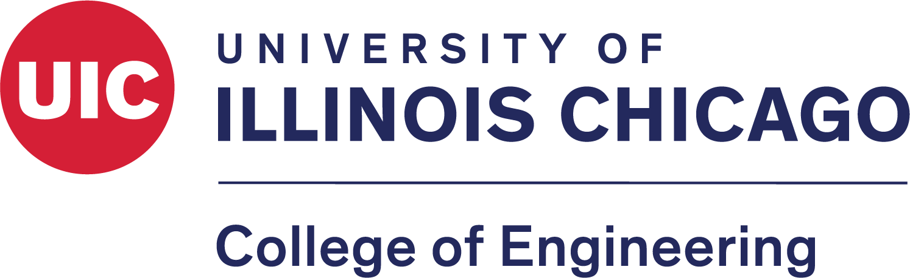

# Academia Overview

## Courses Curriculum

This is a comprehensive repository intended to document the homework and projects (and potentially labs) I have completed as a student of the College of Engineering at the University of Illinois at Chicago; this is where I ultimately completed my Bachelor of Science Degree in Computer Science with a Minor in Mathematics.

## Repo Structure

It is hopefully quite intuitive to click through; simply open the course folder, then seek for a specific work you may wish to see. Ideally, someday, I would like to have running versions of all of these little homeworks/projects/labs directly in a browser and joined together in a neat little UX-enriched web app.

>This is a work in progress; I am iterating through my work in its entirety and aim to describe and demonstrate the work in a tasteful manner.
