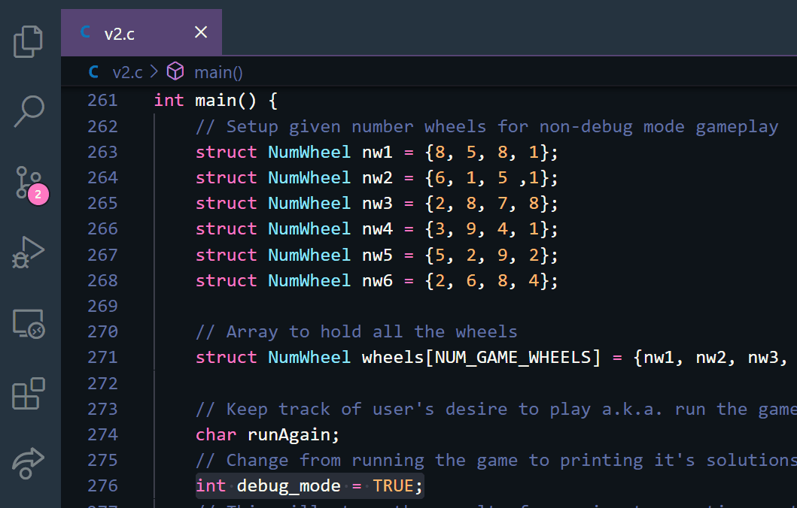

# Stage 2

The second stage (building on the first) generates all 3,185 possible solutions to TwentyFour, the game, and then chooses one at random, which gets presented to the user.

>I.e., we are generating all the possible ways to make the number 24, using any 4 numbers and any 3 operators. Then, we choose one of these solutions as the prompt in the game. We will therefore know the solution to the game before prompting the user, unlike v1.

We should also be able to toggle the showing of the solutions, programatically, like a cheatsheat. __We will call it **`debug mode`** ;)__. Running this second stage should look like the following when debug mode is on:

<pre>
Author: Anthony Makis
Program: #1, TwentyFour

Welcome to the game of TwentyFour.  Using each of the four numbers shown
below exactly once, combining them somehow with the basic mathematical
operators (+,-,*,/) to yield the value twenty-four.  

*** Start Debug Display ***
All possible solutions are:
1: 1+1+1*8
2: 1+1+2*6
3: 1+1*2*6
4: 1*1+2*8
5: 1/1+2*8
6: 1+1*3*4
7: 1*1+3*6
8: 1/1+3*6
9: 1-1+3*8
10: 1*1*3*8
11: 1/1*3*8
12: 1+1*4*3
13: 1+1+4*4
14: 1-1+4*6
15: 1*1*4*6
 <i>... all lines aren't shown for the sake of this readme, but should be in the program output ...</i>
3174: 9+9-6*2
3175: 9-9+6*4
3176: 9/9*6*4
3177: 9+9/6*8
3178: 9+9+7-1
3179: 9/9+7*3
3180: 9+9+8-2
3181: 9-9+8*3
3182: 9/9*8*3
3183: 9+9*8/6
3184: 9+9+9-3
3185: 9*9-9/3
Puzzle to choose is #3176: 9/9*6*4
*** End Debug Display ***
The numbers to use are: 9, 9, 6, 4  

Enter the three operators to be used (+,-,*, or /): <b>/**</b>
9.0 / 9 is: 1.0
1.0 * 4 is: 4.0
4.0 * 6 is 24.0

Well done, genius!

Would you like to play again (Y/N): <b>N</b>

Thanks for playing.  Exiting program...
</pre>

When debug mode is off, output will look as it did in stage 1 (Sans the `Debug Display`).

>Additional Features Required:
>
> - Error checking for length of input, allowing the user to retry
> - Error checking for invalid input characters, allowing the user to retry
>   - _Should display appropriate warnings to the user in either case_

## My Solution in Action

> I have a `Makefile` for quicker compilation, and then we run the executable (v2). `Makefile` is written to support general compilation of most `.c` files, so I will reuse it throughout projects, making updates to it ocassionally.
>
>This was run with `debug mode` set to `TRUE`, which of course prints all the solutions; if you were to set that to `FALSE`, it would switch control flow to the Stage 1 version of the game. To reiterate, when in `debug mode`, we will choose a random solution to show the user. Otherwise, it will choose a number wheel (Stage 1).
