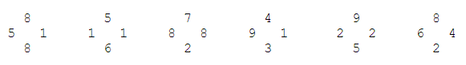
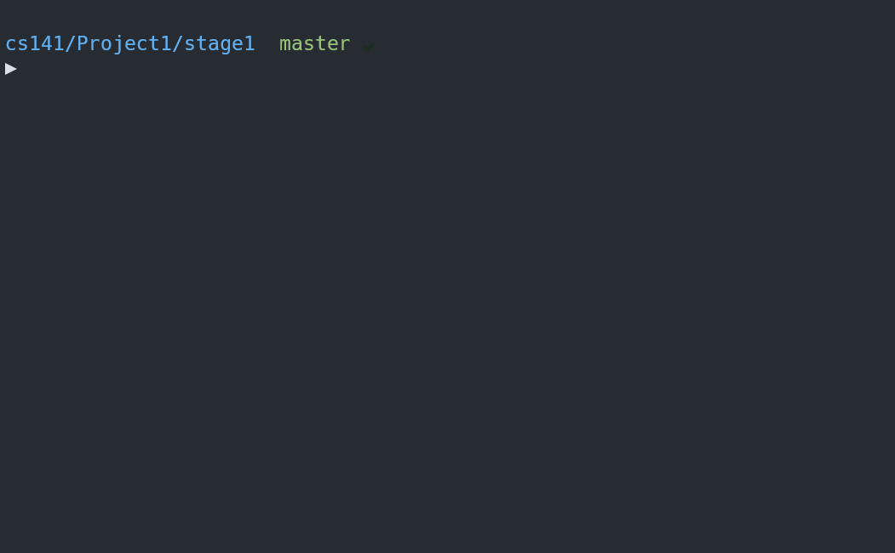

# Stage 1 

The first stage allows users to solve a single puzzle;
running this first stage should look like the following, where user input is shown in **bold**:

<pre>
Author: Anthony Makis
Program: #1, TwentyFour

Welcome to the game of TwentyFour.  Using each of the four numbers shown
below exactly once, combining them somehow with the basic mathematical
operators (+,-,*,/) to yield the value twenty-four.  

The numbers to use are: 3, 9, 4, 1  

Enter the three operators to be used (+,-,*, or /): <b>*-+</b>
3.0 * 9 is: 27.0
27.0 - 4 is: 23.0
23.0 + 1 is 24.0

Well done, genius!

Would you like to play again (Y/N): <b>N</b>

Thanks for playing.  Exiting program...
</pre>

>The four numbers chosen to be presented to the user should randomly chosen to be one of the following:_  
  
>If the user indicates that they *do* want to try again, the program should again randomly choose one of the 6 sets of numbers and display them clockwise starting from the bottom number, such as:
`The numbers to use are: 3, 9, 4, 1 ...`

## My Solution in Action

> I have a `Makefile` for quicker compilation, and then we run the executable (v1). `Makefile` is written to support general compilation of most `.c` files, so I will reuse it throughout projects, making updates to it ocassionally.
