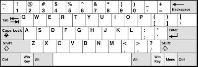
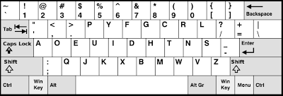

# Project 2: Type Keys

## Background Info

Once upon a time there were keyboards attached directly to printers, and they were called typewriters. They didn't require electricity to work, and they were used by people everywhere for about 130 years. They looked like [this](https://en.wikipedia.org/wiki/Typewriter).

- Oringinally, only one keyboard layout was used; back in 1868 Christopher Sholes patented the typewriter with the QWERTY keyboard, so-called because of the left-to-right order of the top row of letter keys.

- In 1932, Professor August Dvorak at Washington State University set out to develop a better keyboard, with more common keys in the home row, with vowels to one side and consonants to the other, to increase the likelihood of hands taking turns, which seemed like it would speed up typing. He named this keyboard layout after himself.

## Project Description

In this program, we will do a very basic and determinable exploration of the two layouts, comparing and contrasting them. We will do via reading a text file (to act as the document _"being typed"_), and utilizing provided measurements of keys' distances from the home row, and this program assumes user is "touch-typing" using all 10 fingers (8 on home row).

QWERTY Keyboard                |  DVORAK Keyboard
:-----------------------------:|:-----------------------------:
    |  

### Actual Problem to Solve

Some givens we are provided with to bear in mind:

- Upper and lower-case letters are considered the same keyboard position, and so do not need to be treated separately => for time-sensitive purposes, ignore shifting (A = Shift+a)
- For the sake of word counts, white space (space, tab, carriage-return) separates words
- Punctuation at the beginning and at the end of a word should not change the statistics for that word => should _*not*_ be considered as characters in the word:
  - In the word `ain't` , the `'` is considered as part of typing the word
  - In the word `over.` , the `.` is _not_ considred as part of typing the word
- Total distance travelled by fingers is in miles, to 3 decimal places; it also assumes the following things:
  - In the home row typing a middle key is moving `.75 of an inch`
    - `g` or `h` on a QWERTY keyboard
  - Each time a finger leaves the home position for the row immediately above or below, that is moving `.75 of an inch`, with the following exceptions:
    - `T` and `Y` are each `1 inch`;  `B` is `1.25 inches`
  - Each time a finger leaves the home row for the top (numbers) row, that is moving 1.5 inches, with the exception that `6` and `^` are `1.75 inches`

#### Output (Not Accurate, Just for Reference)

```Output
Author: Anthony Makis
Program: #2, Type Keys

First two lines of the input file are:
TWENTY THOUSAND LEAGUES UNDER THE SEA
by JULES VERNE

               Total words:    4326
Total non-blank characters:   32098

                                Qwerty    Dvorak
% All Characters on home row:      3         40
     % All Words on home row:     25         43  
   % Words typed on one hand:     17         13
   Distance travelled(miles):  1.583      0.796
```

### Project Structure

This is to be developed in one stage, procedurally. There are 2 files being provided to us:

- readFromFileAndParseWords.c => basic example of using fgets() to read _"lines"_ of a file
- 20000LeaguesUnderTheSeaJulesVerne.txt => the text file _"being typed"_

### Restrictions for this Project

We were only _*loosely*_ prompted to use fgets() for this task, but other than this there weren't any extra requirements :)

>We were also told that: "For reference sake, typing at 60 wpm for 7 hours a day it would take you over 4 days to type the book". This will be a useful benchmark in retrospect of running the solution.

Any further, atomic requirements are described in the different Stages!

## My Solution in Action


> I have a `Makefile` for quicker compilation, and then we run the executable (v1). `Makefile` is written to support general compilation of most `.c` files, so I will reuse it throughout projects, making updates to it ocassionally.
