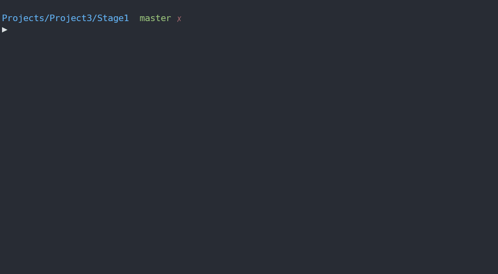

# Stage 1

The first stage will display each IKEA product name that can be found in the English dictionary.

    - The full list of the 1764 unique IKEA product words is in inventory_ikea.txt (which was extracted from here).

    - To see if words exist in English, use the 40,437 word English dictionary dictionary.txt, where the longest word has 21 characters.

When you search for words in general, likely you will be using a binary search => this is a divide-and-conquer search strategy, so time complexity will be theoretically than something like linear search. Finally, *print out* each word that is found!

## My Solution in Action

> I have a `Makefile` for quicker compilation, and then we run the executable (v1). `Makefile` is written to support general compilation of most `.c` files, so I will reuse it throughout projects, making updates to it ocassionally.
