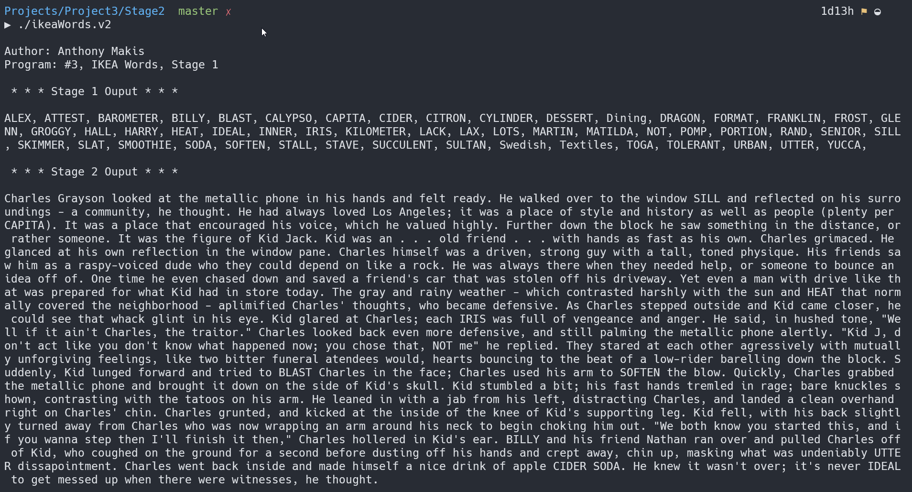

# Stage 1

 In addition to providing your output from Stage 1, now also take some text file called input.txt and capitalize each word that also matches an IKEA product name, displaying the resulting text.

    - E.g. if input.txt contained the word "cider", then that matches IKEA word CIDER, and so CIDER (in all capital letters) would be printed out. For the words that don't match, print them out as-is, with a single space between them.  

    - You don't need to number them or count them or print out the punctuation or line breaks from the original file. In this way all words from inputfile.txt get echoed to the screen, with only the IKEA matching words being capitalized.

>Since you don't know how many words there are in inputfile.txt you should read from that file one word at a time, handling that word as you go.

## My Solution in Action

> I have a `Makefile` for quicker compilation, and then we run the executable (v1). `Makefile` is written to support general compilation of most `.c` files, so I will reuse it throughout projects, making updates to it ocassionally.
