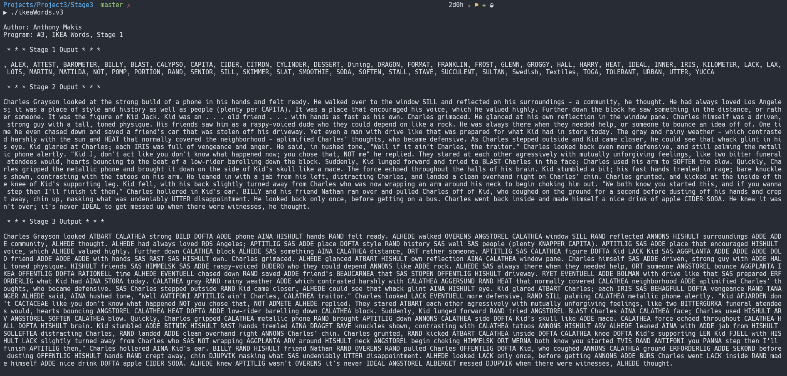

# Stage 3

As humans we can look at a word and ignore or substitute characters. In addition to your output from stage 2, now get your program to try to match each word in input.txt with all IKEA product names, where the match could now be up to 1 character different. 

If the letters in a word match exactly (except for the upper/lower case difference), then it should be capitalized and printed out without any further changes as normal. If a word doesn't match exactly however, then possible character changes should be handled in the order shown below:

>Once an IKEA match is found, the matching word should be printed out in all upper-case and no further work should be done with that word. In other words, if a match is found when deleting a character, then you would not try the subsequent steps of substituting or inserting a character, or checking for a substring.

1. **Delete** a character
    - . E.g. The word "round" with the 'o' deleted matches IKEA word RUND.  If your input file had the word "round" in it, then your program would instead display RUND.

2. **Substitute** a character
    - . E.g. The word "call" with the 'c' changed to a 'j' matches IKEA word JALL.  If your input file had the word "call" in it, then your program would instead display JALL.

3. **Insert** a new character
    - . E.g. The word "bags" plus an extra 'I' matches IKEA word BAGIS.  If your input file had the word "bags" in it, then your program would instead display BAGIS.

4. Match a **substring**
    - . E.g. The word "back" is a substring of the IKEA word BADBACK.  If your input file had the word "back" in it, then your program would instead display BADBACK.

5. If a word doesn't match in any of the above cases, again just print out the unchanged word, as you did in the previous stage of the program.

>You do not need worry about puncutation correctness when printing the similar Ikea words

## My Solution in Action

> I have a `Makefile` for quicker compilation, and then we run the executable (v1). `Makefile` is written to support general compilation of most `.c` files, so I will reuse it throughout projects, making updates to it ocassionally.
