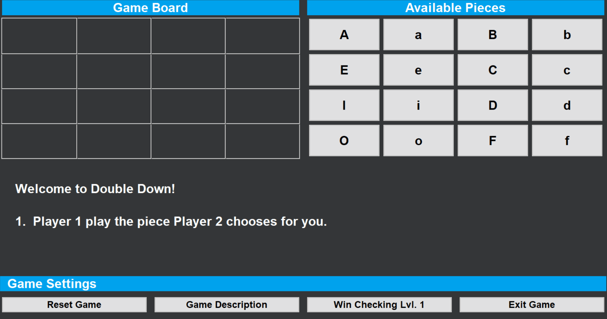

# Project 4: DoubleDown Bonus GUI Creation

## Bonus Description

There is an **optional** portion to this project => bonus stage for those interested. Find some graphics package that works with your computer. Make the program graphical so that to make a move you click once on a piece to select it, then click a second time on a board destination to place the piece there.

### Restrictions for this Project

For just this extra credit you may use classes & objects in C++, though those are beyond the scope of this course.

## My Solution in Action

### Important Information Regarding my Solution

If you would like to see the code in action, this folder DoubleDown contains all the necessary files to put together the Windows Desktop Application Code Solution on MS Visual Studio, which I used to program it (or anything else you would like to use). I made the decision to use VS Code b/c the SDK I used to build the GUI is wxWidgets (following a bit of [this](https://www.youtube.com/watch?v=FOIbK4bJKS8&ab_channel=javidx9) tutorial I found online).

In any event, I have made the final executable / deliverable availabel here. Be weary, as it is of course an unsigned application certification-wise, and will ask you to `allow running` of the application, full-fledged Windows Warning Style.

### The GUI

> I have a `Makefile` for quicker compilation, and then we run the executable (v1). `Makefile` is written to support general compilation of most `.cpp` files, so I will reuse it throughout projects, making updates to it ocassionally.
