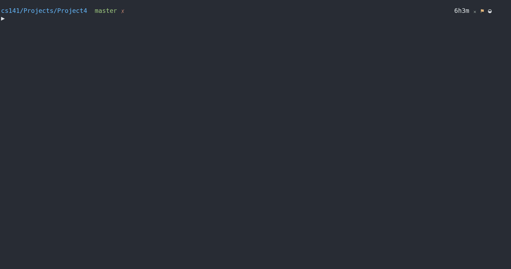

# Project 4: DoubleDown

## Project Description

Write a program to play the game of DoubleDown, a cousin of Tic-Tac-Toe and Quarto (Invented by the professor). This is a two-player game unlike Tic-Tac-Toe in that you don't have __your__ pieces and __their__ pieces, but rather the winner is the one who is first to complete a configuration of 4 pieces of the same type, drawing upon all the pieces remaining to play. Once placed on the board pieces cannot be moved.

### Actual Problem to Solve

1. Display the blank board, square numbers and pieces to play, which should look like I have shown in the output section below.

2.  Board                          |  Pieces
    :-----------------------------:|:-----------------------------:
    Your board should be declared  |Your pieces should likewise be
    as an array of 16 characters   |stored in an array.
    that has all '.' in it to start|  

    >Displaying the board simply displays whatever values are stored in each of the board squares. Later as play progresses the '.' characters will be replaced by other letters, one at a time, and displaying the board array will then end up displaying those characters instead.

3. Prompt for user input of the piece to be played and the destination and make the move.  Note that the opponent selects the piece, and then the player chooses where it should go.  You should list move numbers that increment as valid moves are made. Your program should handle user input with or without a space between the piece and destination, as shown in the example above.

4. Add error checking and appropriate error messages if a player chooses an invalid piece or an invalid destination as illustrated above. Your program must then redisplay the board and re-prompt for the move. Note that the move number only increases after each valid move.

5. Add the option to set the level of play. Before changing the level of play from 1 to 2 you must first check and make sure that there is not already a winning combination using the 4 corner squares or a group of 4 squares in one of the corners (e.g. move 5 in the example above). When prompting for a piece also allow entering 'x' to exit the program.

6. Check for a win in any of the valid configurations. For level 1 this is any row, any column, or either of the two diagonals. For level 2 you would additionally need to check the 4 corners and the 4 corner groups. Once there is a win your program should give a message and exit.

#### Output

```Output
Author: Anthony Makis
Program: #4, DoubleDown

Welcome to the game of DoubleDown, where you try to complete a set
of four pieces that are alike.  Players take turns making moves.
On each move your OPPONENT chooses the piece, then YOU get to
place it on the board.  If you create a set of four alike when
you place your piece, then you win! A set of four alike can be
completed by using four upper case characters, four lower-case
characters, four vowels (a,e,i,o,u) or four consonants.

The game level determines which positions can be used in completing
four alike pieces.  Level one checks for four alike in every row,
column, and diagonal.  Level two additionally checks for the pieces
in the four corners as well as each cluster of four in each corner.
  
When prompted for piece to use you may also:
     Enter 's' to change program level.
     Enter 'x' to exit the program.


     |---------|   Square #  
     | . . . . |  1  2  3  4
     | . . . . |  5  6  7  8
     | . . . . |  9 10 11 12
     | . . . . | 13 14 15 16
     |---------|
         Pieces: AEIO aeio BCDF bcdf

 1. Player 2 enter piece, and Player 1 enter destination: A 6


     |---------|   Square #  
     | . . . . |  1  2  3  4
     | . A . . |  5  6  7  8
     | . . . . |  9 10 11 12
     | . . . . | 13 14 15 16
     |---------|
         Pieces:  EIO aeio BCDF bcdf

 2. Player 1 enter piece, and Player 2 enter destination: B7


     |---------|   Square #  
     | . . . . |  1  2  3  4
     | . A B . |  5  6  7  8
     | . . . . |  9 10 11 12
     | . . . . | 13 14 15 16
     |---------|
         Pieces:  EIO aeio  CDF bcdf

 3. Player 2 enter piece, and Player 1 enter destination: C1


     |---------|   Square #  
     | C . . . |  1  2  3  4
     | . A B . |  5  6  7  8
     | . . . . |  9 10 11 12
     | . . . . | 13 14 15 16
     |---------|
         Pieces:  EIO aeio   DF bcdf

 4. Player 1 enter piece, and Player 2 enter destination: A2
    *** A is an invalid piece selection.
    Please retry move.


     |---------|   Square #  
     | C . . . |  1  2  3  4
     | . A B . |  5  6  7  8
     | . . . . |  9 10 11 12
     | . . . . | 13 14 15 16
     |---------|
         Pieces:  EIO aeio   DF bcdf

 4. Player 1 enter piece, and Player 2 enter destination: a1
    *** Board square 1 is not empty.
    Please retry move.


     |---------|   Square #  
     | C . . . |  1  2  3  4
     | . A B . |  5  6  7  8
     | . . . . |  9 10 11 12
     | . . . . | 13 14 15 16
     |---------|
         Pieces:  EIO aeio   DF bcdf

 4. Player 1 enter piece, and Player 2 enter destination: a2


     |---------|   Square #  
     | C a . . |  1  2  3  4
     | . A B . |  5  6  7  8
     | . . . . |  9 10 11 12
     | . . . . | 13 14 15 16
     |---------|
         Pieces:  EIO  eio   DF bcdf

 5. Player 2 enter piece, and Player 1 enter destination: D11


     |---------|   Square #  
     | C a . . |  1  2  3  4
     | . A B . |  5  6  7  8
     | . . D . |  9 10 11 12
     | . . . . | 13 14 15 16
     |---------|
         Pieces:  EIO  eio    F bcdf

 6. Player 1 enter piece, and Player 2 enter destination: E16


     |---------|   Square #  
     | C a . . |  1  2  3  4
     | . A B . |  5  6  7  8
     | . . D . |  9 10 11 12
     | . . . E | 13 14 15 16
     |---------|
         Pieces:   IO  eio    F bcdf


*** Congratulations! ***  Player 2 wins the game!

Done.
```

>Note the error checking being done on user input at move 4. At any point an entry of 's' leads to the prompt to change the level of the game, which affects which configurations are checked for possible wins (as explained in the game directions). If there is already a group of four in the four corners, or in a group of four in one of the corners, then attempting to change the level to 2 should fail, as shown here:

```Output
...

 2. Player 1 enter piece, and Player 2 enter destination: d2


     |---------|   Square #  
     | b d . . |  1  2  3  4
     | . . . . |  5  6  7  8
     | . . . . |  9 10 11 12
     | . . . . | 13 14 15 16
     |---------|
         Pieces: AEIO aeio BCDF  c f

 3. Player 2 enter piece, and Player 1 enter destination: s

What level of play would you like? 1: Normal, 2: Add corners & groups --> 2
Level of play set to 2


     |---------|   Square #  
     | b d . . |  1  2  3  4
     | . . . . |  5  6  7  8
     | . . . . |  9 10 11 12
     | . . . . | 13 14 15 16
     |---------|
         Pieces: AEIO aeio BCDF  c f

 3. Player 2 enter piece, and Player 1 enter destination: f5


     |---------|   Square #  
     | b d . . |  1  2  3  4
     | f . . . |  5  6  7  8
     | . . . . |  9 10 11 12
     | . . . . | 13 14 15 16
     |---------|
         Pieces: AEIO aeio BCDF  c

 4. Player 1 enter piece, and Player 2 enter destination: s

What level of play would you like? 1: Normal, 2: Add corners & groups --> 1


     |---------|   Square #  
     | b d . . |  1  2  3  4
     | f . . . |  5  6  7  8
     | . . . . |  9 10 11 12
     | . . . . | 13 14 15 16
     |---------|
         Pieces: AEIO aeio BCDF  c

 4. Player 1 enter piece, and Player 2 enter destination: F6


     |---------|   Square #  
     | b d . . |  1  2  3  4
     | f F . . |  5  6  7  8
     | . . . . |  9 10 11 12
     | . . . . | 13 14 15 16
     |---------|
         Pieces: AEIO aeio BCD   c

 5. Player 2 enter piece, and Player 1 enter destination: s

What level of play would you like? 1: Normal, 2: Add corners & groups --> 2
Sorry, changing level would lead to a pre-existing win.
Resetting the level to level 1.

     |---------|   Square #  
     | b d . . |  1  2  3  4
     | f F . . |  5  6  7  8
     | . . . . |  9 10 11 12
     | . . . . | 13 14 15 16
     |---------|
         Pieces: AEIO aeio BCD   c

 5. Player 2 enter piece, and Player 1 enter destination:
```

### Project Structure

This is to be developed in one stage, procedurally. There aren't any files being provided to us, but I will have two files, one for the text-based game, and one for the extra credit GUI:

- doubleDown.c => Text-based version of the game
- DoubleDown Folder => Graphics based version of the game, look to it's README in there

### Restrictions for this Project

At this point in the semester your program should be divided into functions, with parameters used to pass information back and forth. You may now use the following features from **C++**:

- cin/cout, reference parameters
- the bool type
- declaring for loop counter variables within the for loop parenthesis

You may not use any C++ features besides these, or risk point penalty.

>There is a GUI I created for bonus points in the [Bonus Stage](./DoubleDown), in the DoubleDown folder in this directory.

## My Solution in Action

### The Text-based Game



> I have a `Makefile` for quicker compilation, and then we run the executable (v1). `Makefile` is written to support general compilation of most `.cpp` files, so I will reuse it throughout projects, making updates to it ocassionally.
