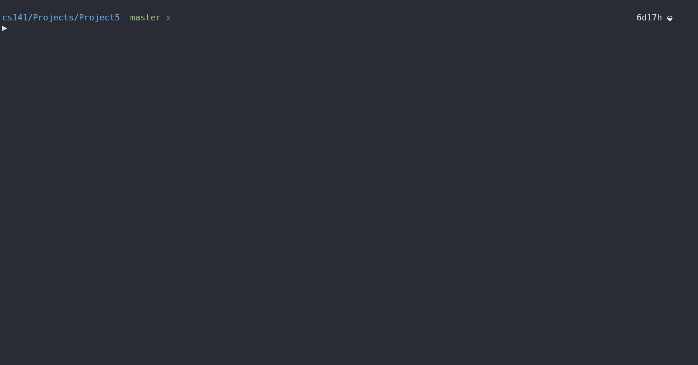

# Project 5: WhatWord

## Project Description

Write a program in C / C++ to create a 4x4 Boggle board.  To play a similar game online see [this site](wordtwist.org).

### Actual Problem to Solve

1. Words must be of length 3 or greater. Scoring is based on word length as follows:
    Letters                          |  Points
    :-------------------------------:|:-------------------------------:
    < 3                              | 0
    3                                | 1
    4                                | 2
    5                                | 4
    6+                               | # of letters

2. Use the dictionary file included as an attachment at the bottom of this page. It has 263,533 words in it.

3. Use the following frequency counts for random character selection used in generating a board:

```C
// {a, b, c, d, e, . . ., z}
{0.07680, 0.09485,  0.13527,  0.16824,  0.28129,  0.29299,  0.32033,  0.34499,  0.43625,  0.43783,  0.44627,  0.49865,  0.52743,  0.59567,  0.66222,  0.69246,  0.69246,  0.76380,  0.86042,  0.92666,  0.95963,  0.96892,  0.97616,  0.97892,  0.99510,  1.00000};
```

4. I suggest you write the program one stage at a time as follows:

    - Declare an array to represent the board and then display the board.

    - Now successively generate a random number between 0 & 1. Loop through the alphabetic table of values shown above while your random number is greater than the current row value. Once the loop stops, the index corresponds to the letter you want.

    - Read in the dictionary file into an array of the appropriate size. *Note that you do _not_ need to keep words of length < 3 or > 16*. Ensure everything is in lower case as you read it in. See [this file](usingArray.c), which reads words from a file into a really large array.

    - Retrieve the dictionary binary search function from a previous program.

    - Allow playing the game, where all you do is the dictionary lookup for now, and don't validate that the word is on the board.

    - When 'r' is entered it should reset the board. You don't have to reset anything else. This would only really make sense to do at the beginning, such as when we are testing your program.

    - Now figure out how to check each word to make sure it is on the board.  This is the most challenging part!

    - Add error checking messages for when word is not in the dictionary, or when it is not found on the board.

    - Add a boolean array to keep track of words found. Use this to display all the words found on each move, and to verify that a word cannot be guessed twice. Note that words found must be displayed in alphabetical order, shortest first. E.g. first display all words found of length 3 in alphabetical order, then display all words found of length 4 in alphabetical order, and so on.

    - Display all the possible words when the user chooses 's'.  Your program should prompt for the min and max lengths of the words to be displayed.  Exit the program after displaying the words.  You will need to choose an approach, which will likely be one of the following:
        - Starting with the characters on the board, generate strings of adjacent letters and see if they are valid dictionary words
        - Alternatively start with the words in the dictionary and see if they can be found on the board

    - When 't' is entered it should toggle the timer.  This doesn't reset the timer, but it simply stops checking it each move, so you can take as long as you would like.  Once the timer is toggled back on, play resumes with whatever value the timer is at that point in time.

#### Output

```Output
Author: Anthony Makis
Program: #4, DoubleDown

Welcome to the game of Boggle, where you play against the clock
to see how many words you can find using adjacent letters on the  
board.  Each letter can be used only once for a given word.
  
When prompted to provide input you may also:
     Enter 'r' to reset the board to user-defined values.
     Enter 's' to solve the board and display all possible words.
     Enter 't' to toggle the timer on/off.
     Enter 'x' to exit the program.
  
The dictionary total number of words is: 263533
Number of words of the right length is:  259709

  60 seconds remaining
a c r l
n e a p
p u i m
s a a n
   Score: 0
1. Enter a word: plain
   Worth 4 points.
Words so far are: plain

  53 seconds remaining
a c r l
n e a p
p u i m
s a a n
   Score: 4
2. Enter a word: can
   Worth 1 points.
Words so far are: can plain

  49 seconds remaining
a c r l
n e a p
p u i m
s a a n
   Score: 5
3. Enter a word: map
   Worth 1 points.
Words so far are: can map plain

  39 seconds remaining
a c r l
n e a p
p u i m
s a a n
   Score: 6
4. Enter a word: can
Sorry, that word was already previously found.
Words so far are: can map plain

  39 seconds remaining
a c r l
n e a p
p u i m
s a a n
   Score: 6
4. Enter a word: acrl
 was not found in the dictionary.

  34 seconds remaining
a c r l
n e a p
p u i m
s a a n
   Score: 6
4. Enter a word: rail
 cannot be formed on this board.

  30 seconds remaining
a c r l
n e a p
p u i m
s a a n
   Score: 6
4. Enter a word: r
Enter 16 characters to be used to set the board: abcdefghijklmnop

  30 seconds remaining
a b c d
e f g h
i j k l
m n o p
   Score: 6
4. Enter a word: s
Enter min and max word lengths to display: 4 7
Words between 4 and 7 are:
bein fink fino glop jink knop koji mink mino nief nife polk ponk knife plonk
Exiting the program.
```

### Project Structure

This is to be developed in unilaterally, procedurally. There are some files provided to us:

- dictionary.txt => A better version of a dictionary of words
- usingArray.cpp => C example of using an array to store string data from a file

### Restrictions for this Project

There are not any major requirements for this project, it is simply recommended to proceed as described in the `Actual Problem to Solve` section above.

## My Solution in Action



> I have a `Makefile` for quicker compilation, and then we run the executable (v1). `Makefile` is written to support general compilation of most `.cpp` files, so I will reuse it throughout projects, making updates to it ocassionally.
