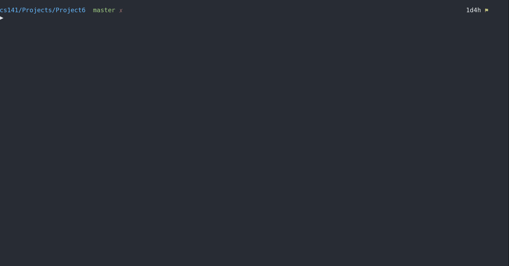

# Project 6: CoinSwap Undo

## Project Description

Write a program to play the coinSwap puzzle, also implementing ability to undo moves.

### Actual Problem to Solve

1. Make a struct to store all game information for each move, and create the necessary list pointers.

2. Each time a move is made the game information must be stored by prepending the game information onto a linked list that successively gets built as each move is made.  Hint: Don't forget to make your list head pointer a reference parameter when using it in a function that changes it.

3. Attempting undo at the beginning of the game should give an error message and allow retrying the move.

4. Anytime after the first move when the user enters 'u' to undo a move the current move is undone and the game resumes at the prompt for the previous move.  To undo the current move you must remove the front node from the linked list, restoring the game to the values stored in the node representing the move before it.  Making a subsequent move must then prepend a new node with the new move information onto the list.
You must get this part to work in order to be eligible for any of the subsequent points shown below.

5. Display the linked list (but just the move number part of each node on the list) after each move and after each undo operation.  This should help you with debugging.

6. After undoing multiple moves back to the beginning of the game you must be able to continue to make moves.

7. If (and only if) the linked list is correctly working to undo a move, you may also earn points by validating the following for each move:
   - The source and destination positions must be within the range 1..5
   - Ensure that 'X' pieces only move to the right, and 'O' pieces only move to the left.  
   - Destination square must be empty
   - Destination must be an adjacent empty square, or must be one square away when jumping.
   - When jumping the jumped piece must be the opponent.

#### Output

```Output
Author: Anthony Makis
Program: #6, CoinSwap Undo

Welcome to the coin swap puzzle.
Make moves to solve the puzzle where the objective is to swap the
place of the pieces on either side of the board.  X can only move
to the right into an empty square, or can jump to the right over  
an O into an empty square. Conversely O can only move to the left
into an empty square, or can jump to the left over an X into an
empty square.  

For each move enter the source (1..5) and destination (1..5).
Enter x to exit the program.

   1 2 3 4 5
   X X   O O    List: 1

1. Enter source and destination: u
*** You cannot undo past the beginning of the game.  Please retry.

   1 2 3 4 5
   X X   O O    List: 1

1. Enter source and destination: 2 3

   1 2 3 4 5
   X   X O O    List: 2->1

2. Enter source and destination: 4 2

   1 2 3 4 5
   X O X   O    List: 3->2->1

3. Enter source and destination: u
* Undoing move *

   1 2 3 4 5
   X   X O O    List: 2->1

2. Enter source and destination: u
* Undoing move *

   1 2 3 4 5
   X X   O O    List: 1

1. Enter source and destination: 1 3
*** A jumped square must have an opponent. Invalid move, please retry
1. Enter source and destination: 2 3

   1 2 3 4 5
   X   X O O    List: 2->1

2. Enter source and destination: 3 2
*** You can't move that piece that direction. Invalid move, please retry.
2. Enter source and destination: 1 2

   1 2 3 4 5
     X X O O    List: 3->2->1

3. Enter source and destination: 0 1
*** You can't refer to a position off the board. Invalid move, please retry.
3. Enter source and destination: u
* Undoing move *

   1 2 3 4 5
   X   X O O    List: 2->1

2. Enter source and destination: 5 2
*** Destination is too far away. Invalid move, please retry.
2. Enter source and destination: 3 4
*** Destination square is not empty. Invalid move, please retry.
2. Enter source and destination: 4 2

   1 2 3 4 5
   X O X   O    List: 3->2->1

3. Enter source and destination: 5 4

   1 2 3 4 5
   X O X O      List: 4->3->2->1

4. Enter source and destination: 3 5

   1 2 3 4 5
   X O   O X    List: 5->4->3->2->1

5. Enter source and destination: 1 3

   1 2 3 4 5
     O X O X    List: 6->5->4->3->2->1

6. Enter source and destination: 2 1

   1 2 3 4 5
   O   X O X    List: 7->6->5->4->3->2->1

7. Enter source and destination: 4 2

   1 2 3 4 5
   O O X   X    List: 8->7->6->5->4->3->2->1

8. Enter source and destination: 3 4

   1 2 3 4 5
   O O   X X    List: 9->8->7->6->5->4->3->2->1

Congratulations, you did it!

Exiting program ...
```

### Project Structure

This is to be developed in unilaterally, procedurally. There are some files provided to us:

- main.cpp => Barebones cpp file to get the project started with

> It allows playing the game, but does not implement any linked list to store moves and does not validate user input.

### Restrictions for this Project

There are not any major requirements for this project, it is simply recommended to proceed as described in the `Actual Problem to Solve` section above.

## My Solution in Action



> I have a `Makefile` for quicker compilation, and then we run the executable (v1). `Makefile` is written to support general compilation of most `.cpp` files, so I will reuse it throughout projects, making updates to it ocassionally.
