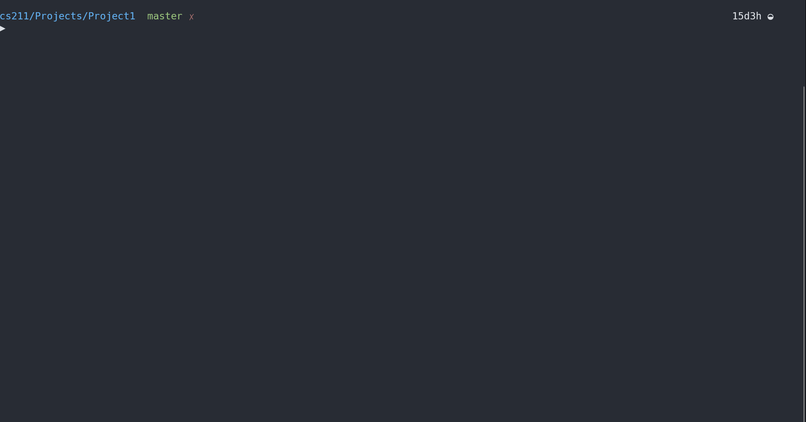

# Project 1

## Project Description

### Signature Suggestions

- Write a function that will make a copy the values from one array to another array.
  - Suggested prototype: `void arrayCopy(int fromArray[], int toArray[], int size);`

- Write your own function that will sort an arrayin ascending order. You may use whatever sorting algorithm you wish.
  - Suggested prototype: `void sort(int arr[], int size);`

- Write your own function that will perform a linear search on the unsorted array. The function is to *return* two values.
  - The first should be the position in the array where the value was found or `-1` if the value was not found.
  - The second is the number of comparisons needed to determine if/where the value is located in the array.
  - Suggested prototype: `int linSearch(int arr[], int size, int target, int* numComparisons);`

- Write your ownfunction that will perform a binary search on the sorted array. The function is to *return* two values.
  - The first should be the position in the array where the value was found or `-1` if the value was not found.
  - The second is the number of comparisons needed to determine if/where the value is located in the array.
  - Suggested prototype: `int binSearch(int arr[], int size, int target, int* numComparisons);`

### Inside of Main Function

- Read in integer input from standard inputand store these values into an array. The values will have a **terminal value** of `-999`. So you read in these values in a loop that stops when the value of `-999` is read in. The use of informative prompts is required for full credit. You may not assume how many numeric values are given on each line. The use of a `scanf()` with the following form is suggested to read in the values: `scanf (“%d”, &val);`

- Make a copy of the integer array using the `arrayCopy()` function described above

- Sort one of the arrays(using the `sort()` function described above), leave the other array unsorted

- Read in integer input from standard input and for each of these values search for the value using both search functions described above (i.e. perform a linear search on the value in the unsorted array and perform a binary search on the value in the sorted array). Using the information returned/sent back from the search functions, print out:
  - Whether the value was found or not found
  - The number of comparisons needed to determine whether the value exists or not in each algorithm
  - And the location in the array where the number is located (if the value does exist in the array).

- Repeat reading in integer values and searching the arrays until the terminal value of `-999` is read in. The use of informative prompts AND descriptive result output is required for full credit.

>You may not assume the input will be less than any set size. Thus you will need to dynamically allocated space for the array.

### Dynamic Allocation

Dynamic Array Allocation allows the space in an array to change during the course of the execution of a program. In C, this requires the use of the malloc() function. To dynamically allocate space for 100 integers, the malloc() code would be as follows:

```C
int *darr;
int size = 100;
darr = (int*) malloc ( size* sizeof(int) );
```

This array can only hold 100 integers and it not really dynamic. To make it truly dynamic, we need to grow the array when we try to put more values into it than can be held by its current size. The following code will double the size of the array:

```C
int *temp;
temp = (int*) malloc ( size * 2 * sizeof(int) );
int i;
for(i = 0; i < size; i++)
    temp[i] = darr[i];
free (darr);
darr = temp;
size = size * 2;
```

### Redirection of Input and Output to Test Your Program

To help test your program, the use of redirection of standard input from a text file is a good idea for this project. Redirection is done at the command line using the less than and greater than signs. Redirection of both input and output can be done; however, for this project, you may only want to use redirection of input.

- Assume you have a text file that is properly formatted to contain the input as someone would type it in for the input called: **proj1input.txt**

- Assume the executable for this project is in a file called: **a.exe**

- To run the project so that it reads the input from this text file instead of standard input using redirection of input, you would typethe following on command line: `a.exe < proj1input.txt`

- To store the output sent to standard output to a file called **outfile.txt** using redirection (the input is still being read from standard input), type: `a.exe > outfile.txt`

- To redirect both standard input and standard output, type: `a.exe < proj1input.txt  > outfile.txt`

>**Note that the code inside of your program will still read from standard input**. Redirection is information given to the Operating System at the command prompt. The Operating Systemthen “redirects” a standard input read operation away from the keyboard and to the specified file while the program is running.

## Project Structure

This is to be developed in one stage, procedurally. There are 2 files being provided to us:

- proj1data1.txt => first sample file of numbers to try with the program
- proj1data2.txt => second sample file of numbers to try with the program

## Restrictions for this Project

Must use dynamic allocation to store input => do not assume size via hardcoding integer sizes.

## My Solution in Action



> I have a `Makefile` for quicker compilation, and then we run the executable (v1). `Makefile` is written to support general compilation of most `.c` files, so I will reuse it throughout projects, making updates to it ocassionally.
