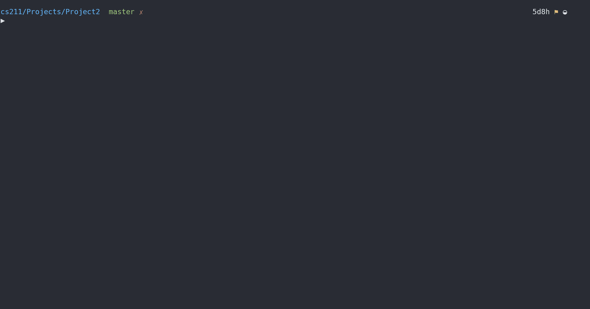

# Project 2: Balanced Symbol Checker

## Background Info

Write a C program that will determine whether input is given with properly balanced symbols. We will often use symbols together to specify the beginning and ending of an item, such as the use of parentheses in a mathematic expression or the use of curly braces in a C, C++ or Java program. For this program, we will be checking the following symbol pairs:

- parentheses: ( )
- curly braces: { }
- square brackets: [ ]
- angle brackets: < >

## Project Guide

A `stack` will be used to implement the program.

The __push__ operation is defined as follows:

```psuedocode
if (the stack array if full)
  grow the array
add the value to the stack array
increment the top-of-stack value
```

The __grow__ operation is defined as follows:

```psudeocode
Allocate a new dynamic array of the larger size
Copy the existing values from the current stack array to the new dynamic array
Deallocate the current stack array
Have the stack array variable refer/point to the new dynamic array
Update the maximum stack size variable
```

### Stack Usage Algorithm

To check for balance symbols in an expression, the expression is inspected from left to right after the entire line is read in.

When an opening symbol is encountered, this symbol is pushed onto the stack. The opening symbols are: ( { [ and <.

When a closing symbol is encountered, check the symbol at the top of the stack.

- If the symbol on the top of the stack is the corresponding opening symbol, pop the stack and continue
- If the symbol on the top of the stack is **NOT** the corresponding opening symbol, the expression is **NOT** balanced and the wrong closing symbol was encountered
- If the stack is empty, the expression is **NOT** balanced and there is a missing opening symbol

When the end of the expression is encountered (i.e. the end of the input line), check to see if the stack is empty

- If the stack is empty, then the expression was balanced
- If the stack is **NOT** empty, the expression was not balanced and there is a missing closing symbol

Since the only input we really care about are the 8 characters that form the 4 symbol pairs and determining when the “end of the expression” is reached, any other input on the line can be ignored.

### Use of C struct and C functions

When writing your code, you **MUST** place all of the data items needed for the stack in a C struct called `stack`. These data items must include the following (and may include others if needed).

- the pointer to the dynamic array that actually holds the stack
- the integer variable specifying the current size of the dynamic array
- the integer variable specifying the top of the stack

The instance of this struct **MUST** be declared locally in `main()`. It may **NOT** be global.
>Note: If you want it to be declared locally in some other function other than `main()`, that is also OK.

You **MUST** write functions for:

- initializing the stack
- checking if the stack is empty
- pushing an element onto the stack
- popping an element off of the stack
- accessing the top element on the stack
- resetting the stack so that it is empty and ready to be used again

All of these functions **MUST** take __as their first parameter__ a pointer to the struct that contains the instance of the stack that is being used.

### Command Line Argument: Debug Mode

Your program is to be able to take one optional command line argument, the -d flag. When this flag is given, your program is to run in "debug" mode. When in this mode, your program is to display a message whenever an item is pushed or popped from the stack.  This message must include the character being pushed or popped. Also, when the stack grows, you are to explicitly state the old and new size of the dynamic array as well as indicate the number of values copies from the current to the new dynamic array.

When the flag is not given, this debugging information should not be displayed. One simple way to set up a "debugging" mode is to use a boolean variable which is set to true when debugging mode is turned on but false otherwise. This debugging mode variable can be set up as a global variable if desired. Then using a simple if statement controls whether information should be output or not.

```C
  if ( debugMode == TRUE )
      printf (" Debugging Information \n");
```

### Input

The input for this program will come from standard input. Each line of input will be a single expression that is to be checked for balanced symbols. You may assume that each line of input is less than `300` characters long.

Since we have limited the length of the input and are trying to process one line of input at a time, the best way to read the input is the `fgets()` function in the `<stdio.h>` library. Since we are reading from standard input, you are to use the value of stdin for the third parameter of `fgets()`. This causes `fgets()` to read input from the standard input. You **MUST** use `fgets()` for this programming project to read in the input.

If the input on the line contains only the letter `q` or `Q`, quit the program.

### Output

For each line of input, your program should display the input and specify whether the expression

- is balanced
- is unbalanced because it is expecting a different closing symbol (the wrong closing symbol is on the top of the stack)
- is unbalanced because it is missing an opening symbol (stack is empty when a closing symbol is encountered)
- is unbalanced because it is missing a closing symbol (line ends while the stack is not empty)

For the unbalanced expression, print the “up arrow” character at the place where the unbalanced error occurred. The following are some examples output showing the 4 possible outcomes:

```output
( ( a a ) < > [ [ [ { [ x ] } ]]] <>)
Expression is balanced

( ( a a ) < > [ [ [ { [ x ] ]]] <>)
                            ^ expecting }

( ( a a ) ) < > > [ [ [ { [ x ] } ]]] <>)
                ^ missing <

( ( a a ) < > [ [ [ { [ x ] } ]]]
                                  ^ missing )
```

## Project Structure

>No extra resources provided.

## Restrictions for this Project

This program will require the use of a stack implemented in a dynamic array. This dynamic array is to grow to a larger size when a push operation would be done to a full array causing an array overflow. For this program, your dynamic array **MUST** start with 2 positions in the array. When the array needs to grow, it size **MUST** grow by 2 additional positions each time (note the array to grow in size from `2` to `4` to `6` to `8` to `10` to ...).

## My Solution in Action



> I have a `Makefile` for quicker compilation, and then we run the executable (v1). `Makefile` is written to support general compilation of most `.c` files, so I will reuse it throughout projects, making updates to it ocassionally.
