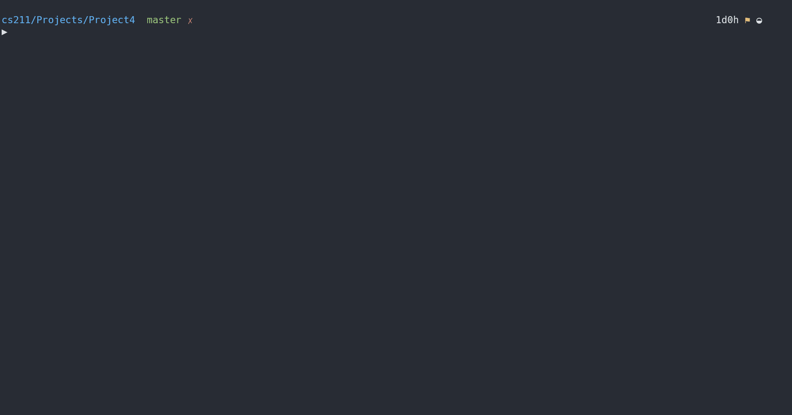

# Project 4: Restaurant Waiting List System

## Background Info

Write a C program that will implement a customer waiting list that might be used by a restaurant. When people want to be seated in the restaurant, they give their name and group size to the host/hostess and then wait until those in front of them have been seated (utilizing a queue structure).

## Project Guide

The system does not take reservations for a specific time and date (i.e. table of 4 for 7pm on Saturday), but it will allow for a group to call ahead and get their name on the waiting list before they arrive.

>Note: these call-ahead groups will still need to check in when they arrive so the host/hostess knows they are waiting in the restaurant.

Groups are added to the wait list when they call-ahead or when they arrive at the restaurant. Groups are always added to the end of the wait list. The system will require that each name used be unique. So when a group is added to the wait list, the system must make sure that no other group is already using that name.

When a table with `N` seats becomes available in the restaurant, the system returns the name of the first group that is in the restaurant and can sit at a table with `N` seats (i.e. the number of seats at the table is greater than or equal to the number of people in that group).

>Note: the group selected may not be the first (or even the second or third) group on the wait list.

This program will __NOT__ keep track of how many tables the restaurant actually has, nor how many people can sit at each table. The host/hostess is expected to know that information and will enter the appropriate values when needed.

### Input/Output

The commands used by this system are listed below and are to come from standard input. Your program is to prompt the user for input and display error messages for unknown commands or improperly formatted commands.

>Note: the name of the group when given will be given as the last item on the input line. The name of the group may contain white space characters in the middle of the name but not at the beginning or end of the name. Each command given must display some information about the command being performed. Code to implement this interface is provided in the program `proj4base.c`.

|Command|Description|
|:---:|:---|
|`q`|Quit the program.|
|`?`|List the commands used by this program and a brief description of each one's usage.|
|`a <size> <name>`|Add the group to the wait list using the given group size and name specifying the group is waiting in the restaurant. The group’s information is added to the end of the list. If the name already exists in the wait list, give an error message and do not add the information.|
|`c <size><name>`|Add the group to the wait list using the given group size and name specifying the group as a call ahead group. The group’s information is added to the end of the list. If the name already exists in the wait list, give an error message and do not add the information.|
|`w <name>`|Mark the call ahead group using the given name as waiting in the restaurant. If the name does not exist is the wait list or is not a call ahead group, give an error message.|
|`r <table-size>`|Retrieve and remove the first group on the wait list that is waiting in the restaurant and is less than or equal to the table size. Note that “first” is the group that has been in the wait list the longest.|
|`l <name>`|List total number of groups that are in the wait list in front of the group specified by the given name. Also list the size of each group that are in the wait list ahead of the group specified by the given name. If the name does not exist, give an error message.|
|`d`|Display the total number of groups in the wait list. Also display the names, group size and in-restaurant status of all groups in the wait list in order from first to last.|

>Note that `<size>` and `<table-size>` are to be integer values and `<name>` is a list of characters. The `<` and `>` symbols are __NOT__ part of the input but being used to describe the input.

### Running Executable & Arguments

#### Debug Flag

Your program must be able to take one optional command line argument, the `-d` flag. When this flag is given, your program is to run in __debug__ mode. When in this mode, your program is to display each group’s information as you traverse through the linked list of the wait list. Note that for the `w`, `r` and `l` commands, the entire list may not be traversed, so you only display the part of the list that is needed to be traversed to complete the command.

One simple way to set up a __debugging__ mode is to use a boolean variable which is set to true when debugging mode is turned on but false otherwise. Then using a simple if statement controls whether information should be outputor not.

```C
if ( debugMode == TRUE )
    printf (" Debugging Information \n");
```

## Project Structure

This is to be developed in one stage, procedurally. There are 5 files being provided to us:

- `proj4Base.c` => starter code provided for user interface
- `multipleSourceCodeFilesExample` => a directory that details an example of compiling code with multiple source/header files involved

## Restrictions for this Project

There are intensive specifications on the nature of file structure as well as queue implementation. Also, it is required to create shared program files for this project, for better cleanliness in code maintenance. This requires a special `Makefile` as well as folder structure, exemplified in the `multipleSourceCodeFilesExample` directory in this project.

### Using the Starter Code (proj4Base.c)

The code given in `proj4base.c` should properly provide for the user interface of this program including _all command error checking_. This program has no code for the linked list. It is your job to write the functions for the specified operations and make the appropriate calls.

Most of the changes to the existing `proj4base.c` program need to be made in each of the `doXXXX()` functions. Look for the comments of:

```C
// add code to perform this operation here
```

>Note: the head of the linked list is required to be a local variable in main and you are required to pass the head of the linked to the operation functions. All of the `doXXXX()` functions currently have no parameters. It will then be expected that you will modify the function signatures of the `doXXXX()` functions to allow for this information to be passed as required.

### More on Queue Implementation

The program must use a __linked list__ to implement the queue-like data structure. It should maintain the following information for each group:

- name (we assume a maximum name length of 30 characters)
- group size
- in-restaurant status (whether the group has called ahead or is waiting in the restaurant)

#### Queue Operations => Linked List Functions

You must write C functions for the following 7 operations. These functions must be called when the specified commands are given as input.

- `addToList()` – This operation is to add a new node to the end of the linked list. This is to be used when the `a` and `c` commands are given as input.

- `doesNameExist()` – This operation is to return a Boolean value indicating whether a name already exists in the linked list. This is to be used when the `a`, `c`, `w` and `l` commands are given as input.

- `updateStatus()` – This operation is to change the in-restaurant status when a call-ahead group arrives at the restaurant. This operation will return a __FALSE__ value if that group is already marked as being in the restaurant. This is to be used when the `w` command is given as input.

- `retrieveAndRemove()` – This operation is to find the first in-restaurant group that can fit at a given table. This operation is to return the name of group. This group is to be removed from the linked list.  This is to be used when the `r` command is given as input.

- `countGroupsAhead()` – This operation is to return the number of groups waiting ahead of a group with a specific name. This is to be used when the `l` command is given as input.

- `displayGroupSizeAhead()` – This operation traverses down the list until a specific group name is encountered. As each node is traversed, print out that node’s group size. This command is to be used when the `l` command is given.

- `displayListInformation()` – This operation to traverse down the entire list from beginning to end. As each node is traversed, print out that node’s group name, group size and in-restaurant status. This command is to be used when the `d` command is given as input.

>Note: there may be a many-to-many relationship between the commands in the user interface and the required functions. For example, the `l` command relies on the following functions: `doesNameExist()`, `countGroupsAhead()` and `displayGroupSizeAhead()`.

#### Use C Structs

When writing your code, you __MUST__ create a C struct for the nodes in the linked list of the wait list. These data items must include the following (and may include others if needed):

- the name of the group
- the integer variable specifying the size of the group (number of people in the group)
- the in-restaurant status (5 extra points for using an enum!)
- a pointer to the next node in the list

The pointer for the head of the linked list __MUST__ be declared as a local variable in `main()` or some other function. _It may __NOT__ be global_. If you wish to have the head of the list enclosed in a structure with some other information, that is _OK_ (but certainly not required). However, the variable used to access this structure may not be global. Each operation performed on the linked list __MUST__ be done in its own function. These functions must take the head of the linked list as their __FIRST__ parameter.

## My Solution in Action



> I have a special `Makefile` this time around, that compiles multiple source files w/ header files too. 
