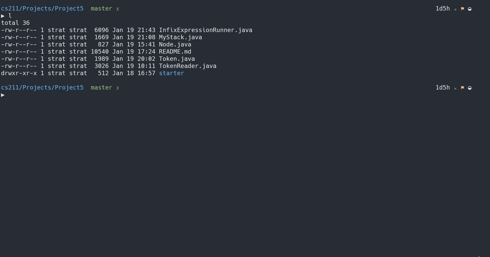

# Project 5: Infix Expression Evaluator

## Background Info

Write a Java program that will evaluate an infix expression, utilizing two stacks that will be of a homegrown implementation.

## Project Guide

### Input/Output

The commands used by this system are listed below and are to come from standard input. Your program is to prompt the user for input and display error messages for unknown commands. The code in `Proj5Base.java` already does this for you. You are expected to use that code as the base for your project.

|Command|Description|
|:---:|:---|
|`q`|Quit the program.|
|`?`|List the commands used by this program and a brief description of how to use each one.|
|`<infixExpression>`|Evaluate the given infix expression and display its result.|

>Note: the `<` and `>` symbols are __NOT__ part of the input but being used to describe the input.

The `<infixExpression>` will only use the operators of addition, subtraction, multiplication, division and the parentheses. It will also only contain unsigned (i.e. positive) integer values.

> We obviously could allow for more operators and more types of values, but the purpose of this assignment is to focus on linked list classes and not on complicated arithmetic expressions.

### Infix vs. Posfix

__Infix Expressions__ are when the operators of addition, subtraction, multiplication and division are listed __between__ the values. Infix Expressions require the use of parentheses to express non-standard precedence. Examples of Infix Expressions are:

```Example
    42 + 64
    60 + 43 * 18 + 57
    (60 + 43) * (18 + 57)
    18 – 12 – 3
    18 – (12 – 3)
```

__Postfix Expressions__ are when the operators of addition, subtraction, multiplication and division are list __after__ (i.e. “post”) the values. Postfix Expressions never require the use of parentheses to express non-standard precedence. The fact that postfix expressions do not need parentheses makes them much easier to evaluate than infix expressions. _In fact, most computers first convert infix expression to a postfix expression and then evaluate that postfix expression._

A Postfix Expression is evaluated using a stack. When a value is encountered, it is pushed onto the stack. When an operator is encountered, two values are popped from the stack. Those values are evaluated using the operation implied by the operator. Then the result is pushed back onto the stack. When the end of a Postfix Expression is encountered, the value on the top of the stack is the result of the expression. There should only be one value on the stack when the end of the Postfix Expression is encountered. Examples of Postfix Expressions are:

```Example
    42 64 +
    60 43 18 * + 57 +
    60 43 + 18 57 + *
    18 12 – 3 –
    18 12 3 – –
```

Both the algorithm to convert an infix expression to a postfix expression and the algorithm to evaluate a postfix expression require the use of stacks. Note that the conversion algorithm requires a stack of operators, while the evaluation algorithm requires a stack of values. For this program, you are to write the following methods for the linked list stack class:

- `boolean isEmpty();`   _// return true if the stack has no members_
- `void push(data);`   _// add the data to the top of the stack_
- `data top();`   _// return the data value on the top of the stack_
- `void pop();`    _// remove the data value from the top of the stack_

You may also wish to write an `initialize()` method to set up the stack (this could be a constructor or a normal method). You can also write a `topPop()` method that combine both the top and pop operations in a single method. Also, note that since the values from the infix expressions will all be integer values (we will only do integer division), and since the operators can all be represented as characters (which is a sub-class of integers), you are more than welcome to write a single linked list structure to be used for both stacks.

The instance/variable containing the head of each linked list __must__ be declared as a local variable to some method (it may be as a local variable to a method other than `main()`). It may __not__ be global. Each operation performed on the linked list __must__ be done in its own method. ALL data members of the linked list class (i.e. the head of the linked list) __must__ use access modifier of private.

### Tokens Class

When getting the input for an infix expression, the program `Proj5Base.java` breaks everything down into _tokens_. There are 3 types of tokens we are mostly concerned with:

- OPERATOR
- VALUE
- EndOfLine

The code in the method `processExpression()` already checks for these tokens but you will need to add the code regarding how they interact with the stacks.

### Algorithm for Infix to Postfix Conversion

First we will define the algorithm use for `popAndEval()`. This algorithm plays a critical role in the overall Evaluation of our expressions.

```Java
    op = top(OperatorStack)
    pop(OperatorStack)
    v2 = top(ValueStack)
    pop(ValueStack)
    v1 = top(ValueStack)
    pop(ValueStack)
    v3 = eval(v1, op, v2)
    push(ValueStack, v3)
```

To keep some of the error handling/recovery simple for this project, if you are trying to perform a top operation on an empty ValueStack, print out an error message and return the value of `-999`. If the operator op for `eval()` is not one of `*`, `/`, `+` or `-`, print out and error message and return the value of `-999`.

### Algorithm for Posftfix Evaluation

__First step:__

```Java
    Empty both the OperatorStack and the ValueStack
```

__Second Step:__

```Java
    While(the current token is not the EndOfLine Token) {
        if(the current token is a VALUE)
            push the value onto the ValueStack
        if(the current token is an OPERATOR) {
            if(the current operator is an Open Parenthesis)
                push the Open Parenthesis onto the OperatorStack
            if(the current operator is + or -) {
                while(the OperatorStack is not Empty &&
                the top of the OperatorStack is +, -, * or /)
                    popAndEval()
                push the current operator on the OperatorStack
            }
            if(the current operator is * or /) {
                while(the OperatorStack is not Empty &&
                the top of the OperatorStack is * or /)
                    popAndEval()
                push the current operator on the OperatorStack
            }
            if( the current operator is a Closing Parenthesis) {
                while(the Operator Stack is not Empty &&
                the top of the OperatorStack is not an Open Parenthesis)
                    popAndEval()
                if(the OperatorStack is Empty)
                    print an error message
                else
                    pop the Open Parenthesis from the OperatorStack
            }
        }
        get the next token from the input
    }
```

__Third Step:__

```Java
    Once the EndOfLine token is encountered
        while(the OperatorStack is not Empty)
            popAndEval()
        Print out the top of the ValueStack at the result of the expression
        Popping the ValueStack should make it empty, print error if not empty
```

>The error statements in the above algorithm should only occur if an invalid infix expression is given as input. You are not required to check for any other errors in the input.

## Running Executable & Arguments

### Debug Flag

Your program is to be able to take one optional command line argument, the `-d` flag. When this flag is given, your program is to run in __"debug"__ mode. When in this mode, your program should display the operators and values as they are encountered in the input. The printing statements for these are already included in the program `Proj5Base.java`.

When the flag is not given, this debugging information should not be displayed. One simple way to set up a "debugging" mode is to use a boolean variable which is set to true when debugging mode is turned on but false otherwise. This variable may be a global variable. Then using a simple if statement controls whether information should be output or not.

```Java
if(debugMode == TRUE)
    System.out.println(" Debugging Information \n");
```

## Project Structure

This is to be developed in one stage, procedurally. There are 5 files being provided to us:

- `Proj5Base.java` => starter code provided for user interface

## Restrictions for this Project

The algorithm __required__ for this program will use two stacks, an `operator` stack and a `value` stack. Both stacks __must__ be implemented using a linked list class.

### Use of Existing Java Libraries

You are responsible to write the code for the linked list stacks __yourself__! This is the primary purpose of this project. Since the Java Libraries already contain a class called `Stack`, you should name your class something like `MyStack` to avoid confusion.

You are not allowed to use any of the classes from the `Java Collections Framework` in this program. These classes include `ArrayList`, `Vector`, `LinkedList`, `List`, `Set`, `Stack`, `HashMap`, etc. If you need such a class, you are to write it yourself.

Documentation on the Java Collections Framework can be found [here](https://docs.oracle.com/en/java/javase/11/docs/api/java.base/java/util/Collections.html).

### Using the Starter Code (Proj5Base.java)

The code given in `Proj5Base.java` should properly provide for the user interface for this program including all command error checking. This program has no code for the linked list. It is your job to write the functions for the specified operations and make the appropriate calls. Most of the changes to the existing program need to be made in the `processExpression()` method. Look
for the comments of:

```Java
// add code to perform this operation here
```

>Note: the instances containing the heads of the linked list are required to be a local variable in a method. The function `processExpression()` is strongly suggested as the method in which to declared the instances of these linked lists.

### Multiple Source Code Files

Your program is to be written using at least two source code files. All of the storage structure code (the linked list code) is to be in one source code file. While the other file (or files if you wish to have more than two source code files) would contain the remainder of the program.

## My Solution in Action


