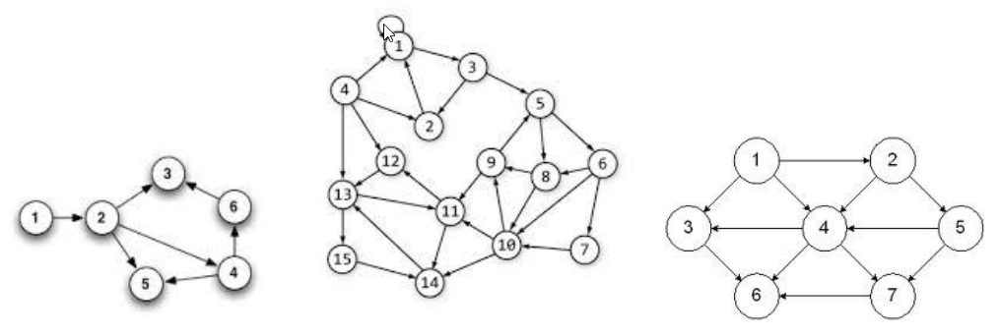
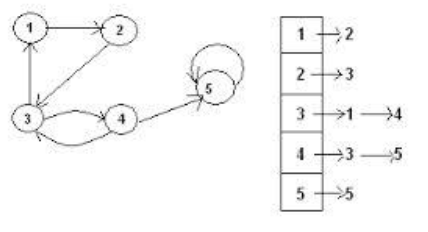

# Project 6: How Can I Get There From Here?

## Background Info

Write a Java Program to represent a travel network. This travel network will use an array of linked lists as its primary storage structure. This type of storage structure is typically called an _adjacency list_.

Assume you have a small airline that flies planes between a small number of airports. Each airport will be given a number. If a plane flies from airport X to airport Y, the network will have an “edge” from X to Y. Below are a number of drawings that could represent this idea. The airports are represented by the circled numbers, the edges are represented by the arrows.

Consider the first drawing. It has 6 airports. It has a plane that flies from airport 1 to airport 2. Three planes fly from airport 2, one to airport 3, one to airport 4 and one to airport 5. No planes leave from airport 3 or from airport 5 (yes, it would be silly to strand planes at those airports, but ignore that fact for now). Planes fly from airport 4 to airports 5 and 6. Finally, planes fly from airport 6 to airport 3.



In an adjacency list, each location/airport needs a list of those locations/airports that one can get to in one move/flight. In this program, we need a list for each airport. If the travel network has N airports, the array will have N linked lists, one for each airport. If airport X has planes flying to 3 different airports, the linked list for airport X would have 3 nodes. Consider the following image showing a travel network and an adjacency list:



There are 5 airports, so we have an array of 5 linked lists. Since Airport 3 can fly planes to two Airports, namely Airport 1 and Airport 4, the linked list for Airport 3 has two nodes. One node containing the value 1. Another node containing the value 4.

## Project Guide

### Input/Output

The input for the operations will come from standard input and from files. The input will initially come from standard input. If the user specified the `f` command, your program will then read input from a file. See the description below for more details.

The commands are to follow the descriptions given below.

>Note: that the form `<int>` could be any integer number and it will __not__ be enclosed in angle brackets. `<int>` is just a notation to specify and integer value. The integer value is to be input on the same line as the command character. If the first character on the line is not one of the following characters, print an error message and ignore the rest of the information on that line.

|Command|Description|
|:---:|:---|
|`q`|Quit the program immediately.|
|`?`|List the commands used by this program for the user.|
|`t <int1> <int2>`|Display a message stating whether a person can travel from airport `<int1>` to airport `<int2>` in one or more flights.|
|`r <int>`|remove all values from the traffic network and resize the array to contain the number of airports as indicated by the given integer value. The value of the integer must be greater than zero. The airports will be numbered from 1 to the given integer value.|
|`i <int1> <int2>`|Insert the edge to indicate a plane flies from airport `<int1>` to airport `<int2>`.|
|`d <int1> <int2>`|Delete the edge that indicates a plane flying from airport `<int1>` to airport `<int2>`.|
|`l`|List all the items contained in the travel network. First display all of the airports (if any) that can be reached from the first airport in one flight (that have an edge in the network), followed by all the airports (if any) that can be reached from the second airport in one flight, etc.|
|`f <filename>`|Open the file indicated by the `<filename>` (assume it is in the current directory) and read commands from this file. When the end of the file is reached, continue reading commands from previous input source. This must be handled using recursion. Beware of causing an infinite recursive loop; the `f` command may not call a file that is currently in use.|

>Initially your program should have the array to hold 10 airports. If a command specifies an airport outside of the current valid range, print an error message and ignore the command.

### Travel Algorithm and the Airport Object

To determine if a person can travel from airport X to airport Y in one or more flights, a recursive depth-first-search algorithm must be used. For this algorithm to work, we will need to be able to mark each airport as visited. Setting up an `Airport` class is required. This object will contain all of the data that one airport knows (the head of the linked list for the airport’s adjacency list and the object will also contain a `Boolean` value to determine if an airport has been visited or not)and the methods to use that data. The travel network __must__ be a dynamic array of these `Airport` objects. The adjacency list will also need a `Node` class/object to store the linked list information.

The pseudo code for this algorithm is as shown below. Note it is valid to ask, _"can I go from airport X to airport X in one or more flights?"_ It really is asking, _“If I leave airport X, can I return to it?”_ This algorithm is recursive and you __must__ use it.

```Java
    void depthFirstSearchHelper(int x, int y) {
        mark all airports as unvisited;
        if(dfs(x, y) == TRUE)
            print(“You can get from airport “ + x + 
                  “to airport “ + y + “ in one or more flights”);
        else
            print (“You can NOT get from airport “ + x + 
                   “ to airport “ + y + “ in one or more flights”);
    }

    boolean dfs(int a, int b) {
        for(each airport c that can be reached from a in one flight) {
            if(c == b)
                return TRUE;
            if(airport c is unvisited) {
                mark airport c as visited;
                if(dfs(c, b) == TRUE)
                    return TRUE;
            }
        }
        return FALSE;
    }
```

### The FILE Command (f)

The `f` command may seem difficult to implement at first, but it has a creative solution that you are to use. The code in the file `Proj6Base.java` is intended to give you an idea on how this solution is to be implemented.

First note that `main()`, is extremely short. It just creates an instance of the `TravelNetwork` class and calls the `processCommandLoop()` method with an instance of the `Scanner` class that reads from standard input. The method `processCommandLoop()` reads from the input source specified by the parameter and determines which command is being invoked.

When the `f` command is invoked, it is to open the file specified by the command, and create a new instance of the `Scanner` class that reads from this file. Then it will make a recursive call to `processCommandLoop()` with this new instance of the `Scanner` class so that the next line of input comes from the specified file instead of where the previous command came from. When the end of a file is reached, the program is to revert back to the previous input source that contained the `f` command. This previous input source could be standard input or a file. By making these calls __recursively__, reverting back to the previous input source is a complete no-brainer.

However, this can cause an infinite loop if you try to access a file that your program is already reading from. Consider this scenario:

>Assume the user enters a command from standard input to start reading from file A.  However; file A tells you to read from file B, file B tells you to read from file C, and file C tells you to read from file A. Since you always start reading from the top of the file, when file C eventually tells the program to read from file A, the program will reprocess the command to read from file B, which will reprocess the command to read from file C, which will reprocess the command to read from file A, which will reprocess the command to read from file B, which will reprocess the command to read from file C, which will reprocess the command to read from file A, which will reprocess...

In order to stop this, you are required to maintain a linked list of file names.  Before the `f` command attempts to create a new instance of the `Scanner` class that read from file X, the f command is to check if the linked list of file names already contains the name of X:

- If the name X already exists in the linked list, the `f` command will __not__ create a new instance of the `Scanner` class and it will __not__ make the recursive call to `processCommandLoop()`.
- If the name X does not exist in the linked list, the f command will add the name X to the linked list before making the recursive call to `processCommandLoop()` and it must remove the name X from the linkedlist after the call to `processCommandLoop()` returns.

You are responsible to write the code for this linked list yourself. Note that this will most likely be a linked list of `String`s, while each airport’s adjacency list will most likely be a linked list of integers.

## Project Structure

This is to be developed in one stage, procedurally. There is one file being provided:

- `Proj6Base.java` => starter code provided for user interface

## Restrictions for this Project

The use of the `Scanner` class for reading in input is expected to be used. It allows for an elegant solution for the input needs of this program. You can use the `Scanner` class to read from standard input or from a file with the use of the proper constructor. You are required to use method(s) to read in your input that take an instance of the `Scanner` class as a parameter (see `f` command below). For ideas on the `Scanner` class, see here:

- [Java Docs For Scanner](https://docs.oracle.com/en/java/javase/11/docs/api/java.base/java/util/Scanner.html)
- [Blog on Scanner Usage: UTA](https://www.cs.utexas.edu/users/ndale/Scanner.html)

Also note that all data structures in this program are of your own design, not an existing Java Library.

### Using the Starter Code (Proj6Base.java)

The code given in `Proj6Base.java` should provide insight into how to process the `f` command.

### Multiple Source Code Files

Your program is to be written using at least two source code files. All of the storage structure code is to be in one source code file called `Airport.java`. While the other file (or files if you wish to have more than two source code files) would contain the main method, `AirportRunner.java`.

## My Solution in Action


