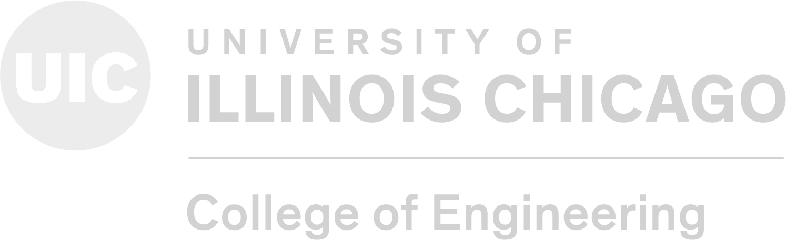

# Academia Overview

## Courses Curriculum

This is a comprehensive repository intended to document the homework and projects (and potentially labs) I have completed as a software engineering student in Chicago; this is where I ultimately completed my Bachelor of Science Degree in Computer Science with a Minor in Mathematics.

## Repo Structure

It is hopefully quite intuitive to click through; simply open the course folder, then seek for a specific work you may wish to see. Ideally, someday, I would like to have running versions of all of these little homeworks/projects/labs directly in a browser and joined together in a neat little UX-enriched web app.

>This is a work in progress; I am iterating through my existing schoolwork (collected untidily for `4 years`) in its entirety, and aim to describe/demonstrate these works in a tasteful manner.
>Note: I directly avoid mentioning my university, save in the image above, to avoid my repo being too readily indexable for the web. This way, my code is more difficult to find for anyone trying to plagiarise.

### A Word on the README Files

The README markdown files in the child directories of this repository are mainly project/lab/homework writeups from the classes I have taken. They are written in the future tense often, however my solution code accompanies the READMEs.

## Coursework Directory

- [cs141](./cs141)
- [cs211](./cs211)
- [cs251](./cs251)
